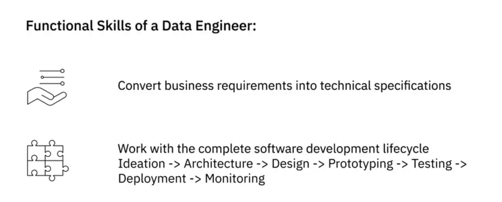
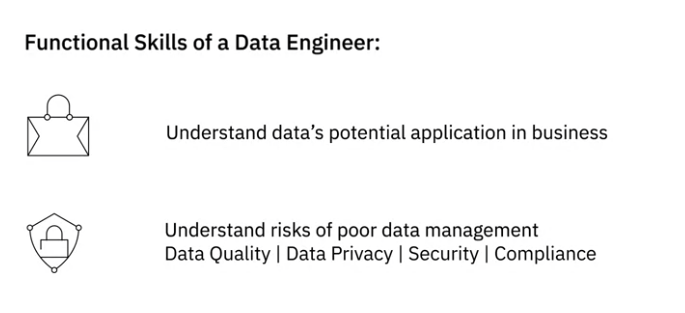
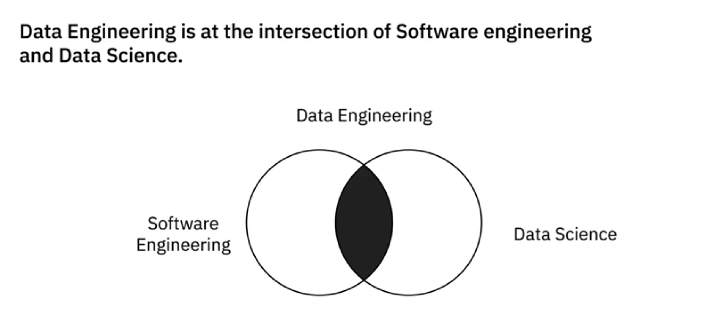
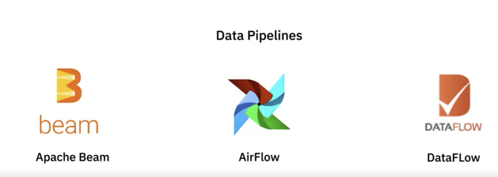
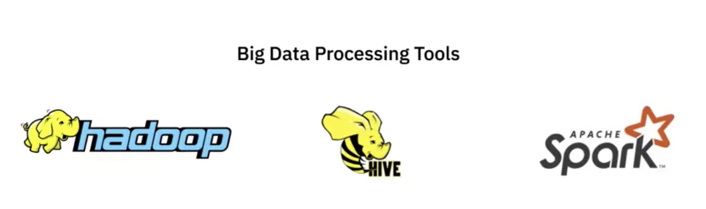
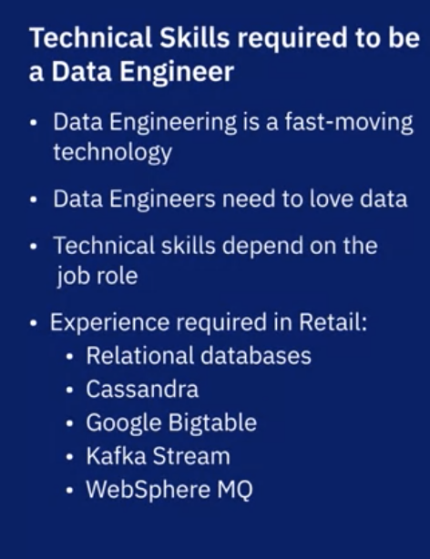

# Introduction to Data Engineering

## Modern Data Ecosystem and role of Data Engineering

In this lesson, you have learned:

Modern data ecosystem includes a network of interconnected and continually evolving entities that include:

- Data, that is available in a host of different formats, structures, and sources. 
- Enterprise Data Environment, in which raw data is staged so it can be organized, cleaned, and optimized for use by end-users.
- End-users, such as business stakeholders, analysts, and programmers who consume data for various purposes.

Emerging technologies such as Cloud Computing, Machine Learning, and Big Data, are continually reshaping the data ecosystem and the possibilities it offers.

Data Engineers, Data Analysts, Data Scientists, Business Analysts, and Business Intelligence Analysts, all play a vital role in the ecosystem for deriving insights and business results from data.

The goal of Data Engineering is to make quality data available for analytics and decision-making. And it does this by collecting raw source data, processing data so it becomes usable, storing data, and making quality data available to users securely.  

## Responsibilities and Skillsets of a Data Engineer

In this lesson, you have learned:

The role of a Data Engineer includes:

- Gathering data from disparate sources.
- Integrating data into a unified view for data consumers.
- Preparing data for analytics and reporting.
- Managing data pipelines for a continuous flow of data from source to destination systems.
- Managing the complete infrastructure for the collection, processing, and storage of data.

To be successful in their role, Data Engineers need a mix of technical, functional, and soft skills.

- Technical Skills include working with different operating systems and infrastructure components such as virtual machines, networks, and application services. It also includes working with databases and data warehouses, data pipelines, ETL tools, big data processing tools, and languages for querying, manipulating, and processing data. 
- An understanding of the potential application of data in business is an important skill for a data engineer. Other functional skills include the ability to convert business requirements into technical specifications, an understanding of the software development lifecycle, and the areas of data quality, privacy, security, and governance. 
- Soft Skills include interpersonal skills, the ability to work collaboratively, teamwork, and effective communication. 

## The Data Ecosystem and Languages for Data Professionals

In this lesson, you have learned:

A Data Engineer’s ecosystem includes the infrastructure, tools, frameworks, and processes for extracting data, architecting and managing data pipelines and data repositories, managing workflows, developing applications, and managing BI and Reporting tools.

Based on how well-defined the structure of the data is, data can be categorized as

- Structured data, that is data which is well organized in formats that can be stored in databases.
- Semi-structured data, that is data which is partially organized and partially free-form.
- Unstructured data, that is data which can not be organized conventionally into rows and columns.

Data comes in a wide-ranging variety of file formats, such as, delimited text files, spreadsheets, XML, PDF, and JSON, each with its own list of benefits and limitations of use.

Data is extracted from multiple data sources, ranging from relational and non-relational databases, to APIs, web services, data streams, social platforms, and sensor devices.

Once the data is identified and gathered from different sources, it needs to be staged in a data repository so that it can be prepared for analysis. The type, format, and sources of data influence the type of data repository that can be used.

Data professionals need a host of languages that can help them extract, prepare, and analyse data. These can be classified as:

- Querying languages, such as SQL, used for accessing and manipulating data from databases.
- Programming languages such as Python, R, and Java, for developing applications and controlling application behavior.
- Shell and Scripting languages, such as Unix/Linux Shell, and PowerShell, for automating repetitive operational tasks.

