# Introduction to Data Engineering

   * [Modern Data Ecosystem and role of Data Engineering](#modern-data-ecosystem-and-role-of-data-engineering)
   * [Responsibilities and Skillsets of a Data Engineer](#responsibilities-and-skillsets-of-a-data-engineer)
   * [The Data Ecosystem and Languages for Data Professionals](#the-data-ecosystem-and-languages-for-data-professionals)
   * [Data Repositories, Data Pipelines](#data-repositories-data-pipelines)
   * [The data ecosystem languages](#the-data-ecosystem-languages)
   * [Data Platforms, Data Stores and Data Security](#data-platforms-data-stores-and-data-security)
   * [Data Collection and Wrangling](#data-collection-and-wrangling)
   * [Querying Data, Performance Tuning, Troubleshooting](#querying-data-performance-tuning-troubleshooting)
   * [Gouvernance and Compliance](#gouvernance-and-compliance)
   * [Overview of the DataOps Methodology](#overview-of-the-dataops-methodology)
      * [DataOps Methodology:](#dataops-methodology)
      * [Benefits of using the DataOps methodology:](#benefits-of-using-the-dataops-methodology)
   * [Career Opportunities](#career-opportunities)
   * [Screenshots](#screenshots)
   

## Modern Data Ecosystem and role of Data Engineering

In this lesson, you have learned:

Modern data ecosystem includes a network of interconnected and continually evolving entities that include:

- Data, that is available in a host of different formats, structures, and sources. 
- Enterprise Data Environment, in which raw data is staged so it can be organized, cleaned, and optimized for use by end-users.
- End-users, such as business stakeholders, analysts, and programmers who consume data for various purposes.

Emerging technologies such as Cloud Computing, Machine Learning, and Big Data, are continually reshaping the data ecosystem and the possibilities it offers.

Data Engineers, Data Analysts, Data Scientists, Business Analysts, and Business Intelligence Analysts, all play a vital role in the ecosystem for deriving insights and business results from data.

The goal of Data Engineering is to make quality data available for analytics and decision-making. And it does this by collecting raw source data, processing data so it becomes usable, storing data, and making quality data available to users securely.  

## Responsibilities and Skillsets of a Data Engineer

In this lesson, you have learned:

The role of a Data Engineer includes:

- Gathering data from disparate sources.
- Integrating data into a unified view for data consumers.
- Preparing data for analytics and reporting.
- Managing data pipelines for a continuous flow of data from source to destination systems.
- Managing the complete infrastructure for the collection, processing, and storage of data.

To be successful in their role, Data Engineers need a mix of technical, functional, and soft skills.

- Technical Skills include working with different operating systems and infrastructure components such as virtual machines, networks, and application services. It also includes working with databases and data warehouses, data pipelines, ETL tools, big data processing tools, and languages for querying, manipulating, and processing data. 
- An understanding of the potential application of data in business is an important skill for a data engineer. Other functional skills include the ability to convert business requirements into technical specifications, an understanding of the software development lifecycle, and the areas of data quality, privacy, security, and governance. 
- Soft Skills include interpersonal skills, the ability to work collaboratively, teamwork, and effective communication. 

## The Data Ecosystem and Languages for Data Professionals

In this lesson, you have learned:

A Data Engineer’s ecosystem includes the infrastructure, tools, frameworks, and processes for extracting data, architecting and managing data pipelines and data repositories, managing workflows, developing applications, and managing BI and Reporting tools.

Based on how well-defined the structure of the data is, data can be categorized as

- Structured data, that is data which is well organized in formats that can be stored in databases.
- Semi-structured data, that is data which is partially organized and partially free-form.
- Unstructured data, that is data which can not be organized conventionally into rows and columns.

Data comes in a wide-ranging variety of file formats, such as, delimited text files, spreadsheets, XML, PDF, and JSON, each with its own list of benefits and limitations of use.

Data is extracted from multiple data sources, ranging from relational and non-relational databases, to APIs, web services, data streams, social platforms, and sensor devices.

Once the data is identified and gathered from different sources, it needs to be staged in a data repository so that it can be prepared for analysis. The type, format, and sources of data influence the type of data repository that can be used.

Data professionals need a host of languages that can help them extract, prepare, and analyse data. These can be classified as:

- Querying languages, such as SQL, used for accessing and manipulating data from databases.
- Programming languages such as Python, R, and Java, for developing applications and controlling application behavior.
- Shell and Scripting languages, such as Unix/Linux Shell, and PowerShell, for automating repetitive operational tasks.

## Data Repositories, Data Pipelines

In this lesson, you have learned:

A Data Repository is a general term that refers to data that has been collected, organized, and isolated so that it can be used for reporting, analytics, and also for archival purposes. 

The different types of Data Repositories include:

- Databases, which can be relational or non-relational, each following a set of organizational principles, the types of data they can store, and the tools that can be used to query, organize, and retrieve data.
- Data Warehouses, that consolidate incoming data into one comprehensive store house. 
- Data Marts, that are essentially sub-sections of a data warehouse, built to isolate data for a particular business function or use case.
- Data Lakes, that serve as storage repositories for large amounts of structured, semi-structured, and unstructured data in their native format.
- Big Data Stores, that provide distributed computational and storage infrastructure to store, scale, and process very large data sets.

The ETL, or Extract Transform and Load, Process is an automated process that converts raw data into analysis-ready data by:

- Extracting data from source locations.
- Transforming raw data by cleaning, enriching, standardizing, and validating it.
- Loading the processed data into a destination system or data repository.

The ELT, or Extract Load and Transfer, Process is a variation of the ETL Process. In this process, extracted data is loaded into the target system before the transformations are applied. This process is ideal for Data Lakes and working with Big Data.

Data Pipeline, sometimes used interchangeably with ETL and ELT, encompasses the entire journey of moving data from its source to a destination data lake or application, using the ETL or ELT process.

Data Integration Platforms combine disparate sources of data, physically or logically, to provide a unified view of the data for analytics purposes.

## The data ecosystem languages

In this lesson, you have learned:

Big Data refers to the vast amounts of data that is being produced each moment of every day, by people, tools, and machines. The sheer velocity, volume, and variety of data challenged the tools and systems used for conventional data, leading to the emergence of processing tools and platforms designed specifically for Big Data. Big Data processing technologies help derive value from big data. These include NoSQL databases and Data Lakes and open-source technologies such as Apache Hadoop, Apache Hive, and Apache Spark.

- Hadoop provides distributed storage and processing of large datasets across clusters of computers. One of its main components, the Hadoop File Distribution System, or HDFS, is a storage system for big data.
- Hive is a data warehouse software for reading, writing, and managing large datasets.
- Spark is a general-purpose data processing engine designed to extract and process large volumes of data. 

## Data Platforms, Data Stores and Data Security

In this lesson, you have learned:

The architecture of a data platform can be seen as a set of layers, or functional components, each one performing a set of specific tasks. These layers include:

- Data Ingestion or Data Collection Layer, responsible for bringing data from source systems into the data platform.
- Data Storage and Integration Layer, responsible for storing and merging extracted data.
- Data Processing Layer, responsible for validating, transforming, and applying business rules to data.
- Analysis and User Interface Layer, responsible for delivering processed data to data consumers.
- Data Pipeline Layer, responsible for implementing and maintaining a continuously flowing data pipeline.

A well-designed data repository is essential for building a system that is scalable and capable of performing during high workloads.  The choice or design of a data store is influenced by the type and volume of data that needs to be stored, the intended use of data, and storage considerations. The privacy, security, and governance needs of your organization also influence this choice. The CIA, or Confidentiality, Integrity, and Availability triad are three key components of an effective strategy for information security. The CIA triad is applicable to all facets of security, be it infrastructure, network, application, or data security.

## Data Collection and Wrangling

In this lesson, you have learned:

Depending on where the data must be sourced from, there are a number of methods and tools available for gathering data. These include query languages for extracting data from databases, APIs, Web Scraping, Data Streams, RSS Feeds, and Data Exchanges. 

Once the data you need has been gathered and imported, your next step is to make it analytics-ready. This is where the process of Data Wrangling, or Data Munging, comes in.  Data Wrangling involves a whole range of transformations and cleansing activities performed on the data. Transformation of raw data includes the tasks you undertake to: 

- Structurally manipulate and combine data using Joins and Unions. 
- Normalize data, that is, clean the database of unused and redundant data.
- Denormalize data, that is, combine data from multiple tables into a single table so that it can be queried faster.

Cleansing activities include: 

- Profiling data to uncover anomalies and quality issues.
- Visualizing data using statistical methods in order to spot outliers. 
- Fixing issues such as missing values, duplicate data, irrelevant data, inconsistent formats, syntax errors, and outliers. 

A variety of software and tools are available for the data wrangling process. Some of the popularly used ones include Excel Power Query, Spreadsheets, OpenRefine, Google DataPrep, Watson Studio Refinery, Trifacta Wrangler, Python, and R, each with their own set of features, strengths, limitations, and applications.

## Querying Data, Performance Tuning, Troubleshooting

In this lesson, you have learned,

- In order for raw data to become analytics-ready, a number of transformation and cleansing tasks need to be performed on raw data. And that requires you to understand your dataset from multiple perspectives. One of the ways in which you can explore your dataset is to query it. 
- Basic querying techniques can help you explore your data, such as, counting and aggregating a dataset, identifying extreme values, slicing data, sorting data, filtering patterns, and grouping data.
- In a data engineering lifecycle, the performance of data pipelines, platforms, databases, applications, tools, queries, and scheduled jobs, need to be constantly monitored for performance and availability. 
- The performance of a data pipeline can get impacted if the workload increases significantly, or there are application failures, or a scheduled job does not work as expected, or some of the tools in the pipeline run into compatibility issues. 
- Databases are susceptible to outages, capacity overutilization, application slowdown, and conflicting activities and queries being executed simultaneously. 
- Monitoring and alerting systems collect quantitative data in real time to give visibility into the performance of data pipelines, platforms, databases, applications, tools, queries, scheduled jobs, and more.
- Time-based and condition-based maintenance schedules generate data that helps identify systems and procedures responsible for faults and low availability.

## Gouvernance and Compliance

In this lesson, you have learned:

Data Governance is a collection of principles, practices, and processes that help maintain the security, privacy, and integrity of data through its lifecycle.

Personal Information and Sensitive Personal Information, that is, data that can be traced back to an individual or can be used to identify or cause harm to an individual, needs to be protected through governance regulations. 

General Data Protection Regulation, or GDPR, is one such regulation that protects the personal data and privacy of EU citizens for transactions that occur within EU member states.  Regulations, such as HIPAA (Health Insurance Portability and Accountability Act) for Healthcare, PCI DSS (Payment Card Industry Data Security Standard) for retail, and SOX (Sarbanes Oxley) for financial data are some of the industry-specific regulations. 

Compliance covers the processes and procedures through which an organization adheres to regulations and conducts its operations in a legal and ethical manner.

Compliance requires organizations to maintain an auditable trail of personal data through its lifecycle, which includes acquisition, processing, storage, sharing, retention, and disposal of data.

Tools and technologies play a critical role in the implementation of a governance framework, offering features such as:

- Authentication and Access Control.
- Encryption and Data Masking.
- Hosting options that comply with requirements and restrictions for international data transfers.
- Monitoring and Alerting functionalities.
- Data erasure tools that ensure deleted data cannot be retrieved.

## Overview of the DataOps Methodology

Gartner defines DataOps as a collaborative data management practice focused on improving the communication, integration, and automation of data flows between data managers and consumers across an organization. DataOps aims to create predictable delivery and change management of data, data models, and related artifacts. DataOps uses technology to automate data delivery with the appropriate levels of security, quality, and metadata to improve the use and value of data in a dynamic environment.” (Source: https://blogs.gartner.com/nick-heudecker/hyping-dataops/) A small team working on a simpler or limited number of use cases can meet business requirements efficiently. As data pipelines and data infrastructures get more complex, and data teams and consumers grow in size, you need development processes and efficient collaboration between teams to govern the data and analytics lifecycle. From data ingestion and data processing to analytics and reporting, you need to reduce data defects, ensure shorter cycle times, and ensure 360-degree access to quality data for all stakeholders. DataOps helps you achieve this through metadata management, workflow and test automation, code repositories, collaboration tools, and orchestration to help manage complex tasks and workflows. Using the DataOps methodology ensures all activities occur in the right order the right security permissions. It helps set in a continual process that allows you to cut wastages, streamline steps, automate processes, increase throughput, and improve continually. Several DataOps Platforms are available in the market, some of the popular ones being IBM DataOps, Nexla, Switchboard, Streamsets, and Infoworks.

### DataOps Methodology:

The purpose of the DataOps Methodology is to enable an organization to utilize a repeatable process to build and deploy analytics and data pipelines. Successful implementation of this methodology allows an organization to know, trust, and use data to drive value.

It ensures that the data used in problem-solving and decision making is relevant, reliable, and traceable and improves the probability of achieving desired business outcomes. And it does so by tackling the challenges associated with inefficiencies in accessing, preparing, integrating, and making data available.

In a nutshell, the DataOps Methodology consists of three main phases:

- The **Establish DataOps Phase** provides guidance on how to set up the organization for success in managing data.
- The **Iterate DataOps Phase** delivers the data for one defined sprint.
- The **Improve DataOps Phase** ensures learnings from each sprint is channeled back to continually improve the DataOps process.

The figure below presents a high-level overview of these phases and the key activities within each of these phases.

### Benefits of using the DataOps methodology:

Adopting the DataOps methodology helps organizations to organize their data and make it more trusted and secure. Using the DataOps methodology, organizations can:

- Automate metadata management and catalog data assets, making them easy to access.
- Trace data lineage to establish its credibility and for compliance and audit purposes.
- Automate workflows and jobs in the data lifecycle to ensure data integrity, relevancy, and security.
- Streamline the workflow and processes to ensure data access and delivery needs can be met at optimal speed.
- Ensure a business-ready data pipeline that is always available for all data consumers and business stakeholders.
- Build a data-driven culture in the organization through automation, data quality, and governance.

As a data practitioner, using the methodology can help you reduce development time, cut wastages and duplication of effort, increase your productivity and throughput, and ensure that your actions produce the best possible quality of data. 

With DataOps, data professionals, consumers, and stakeholders can collaborate more effectively towards the shared goal of creating valuable insights for business. While implementing the methodology will require systemic change, time, and resources, but in the end, it makes data and analytics more efficient and reliable.

Interestingly, it also opens up additional career opportunities for you as a data engineer. **DataOps Engineers** are technical professionals that focus on the development and deployment lifecycle rather than the product itself. And as you grow in experience, you can move into more specialist roles within DataOps, contributing to defining the data strategy, developing and deploying business processes, establishing performance metrics, and measuring performance.

## Career Opportunities

In this lesson, you have learned:

Data Engineering is reported to be one of the top ten jobs experiencing tremendous growth in the U.S. today. It is also reported to be one of the fastest growing tech occupations with year-over-year growth of around 50%. 

Currently, the demand for skilled data engineers far outweighs the supply, which means companies are willing to pay a premium to hire skilled data engineers.

Data engineering roles in organizations tend to break the specialization up into Data Architecture, Database Design and Architecture, Data Platforms, Data Pipelines and ETL, Data Warehouses, and Big Data.

Regardless of the niche you choose to specialize in, knowledge of operating systems, languages, databases, and infrastructure components, is essential. 

To work your way up from a Junior Data Engineer to a Lead or Principal Data Engineer, you need to continually advance your technical, functional, and soft skills from a foundational level to an expert level. You need to not only expand your skills in your niche area, but also into other areas of data engineering at the same time.

Big Data Engineers and Machine Learning Engineers are some of the emerging roles in this field and they require specialized skills in addition to basic data engineering.

There are several paths you can consider in order to gain entry into the data engineering field. 

- An academic degree in Computer Science or engineering qualifies you for an entry-level job.
- If you are not a graduate, or a graduate in a non-relate stream, you can earn professional certifications from online multi-course specializations offered by learning platforms such as Coursera, edX, and Udacity.
- If you have a coding background, or you are an IT Support Specialist, a Software Tester, a Programmer, or a data professional such as a Statistician, Data Analyst, or BI Analyst, you can upskill with the help of online courses to become a Data Engineer. 

## Screenshots

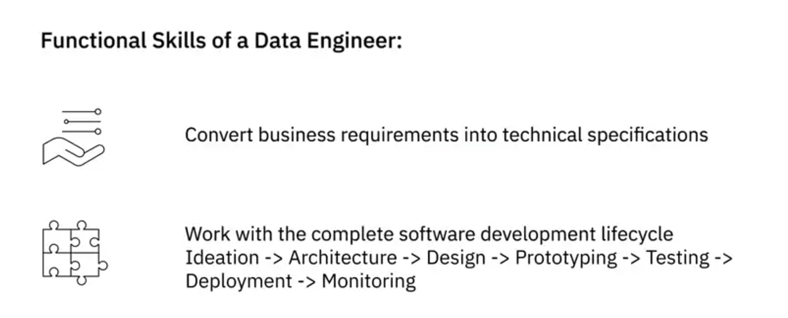
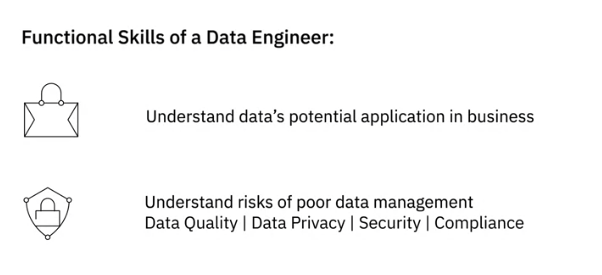
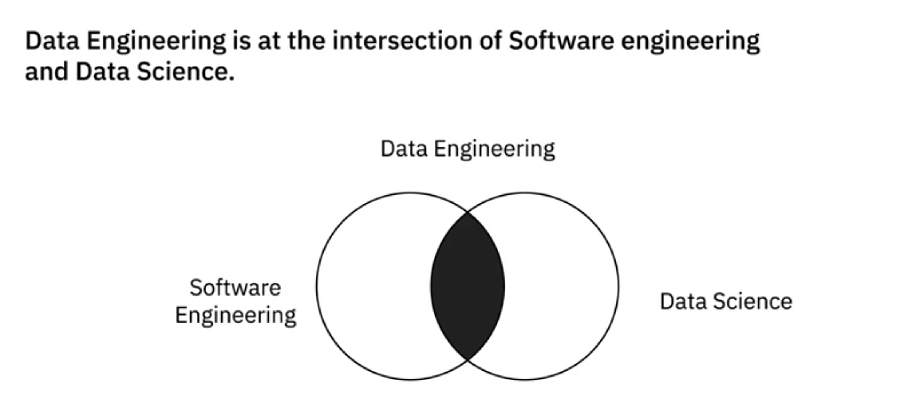
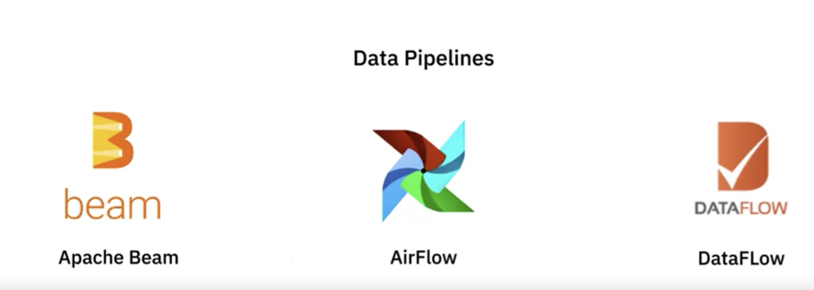
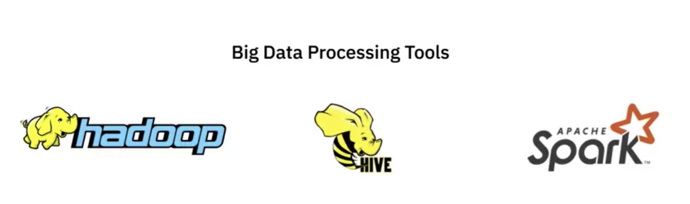
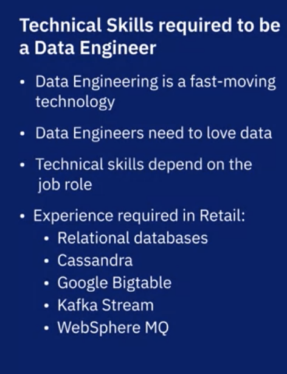
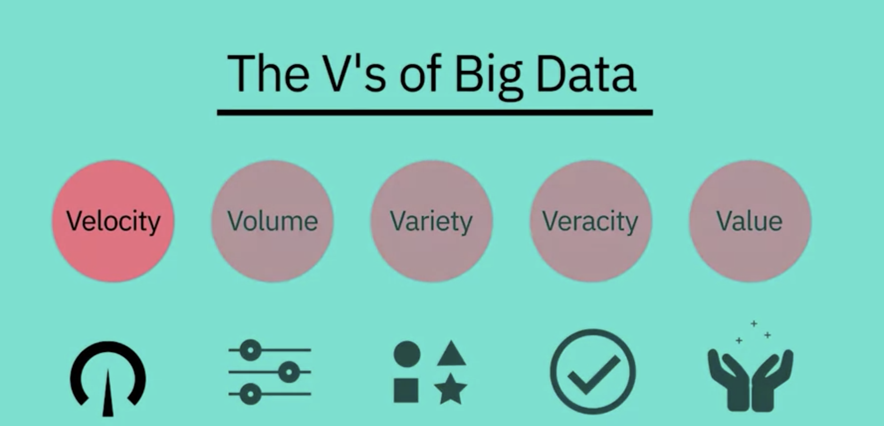

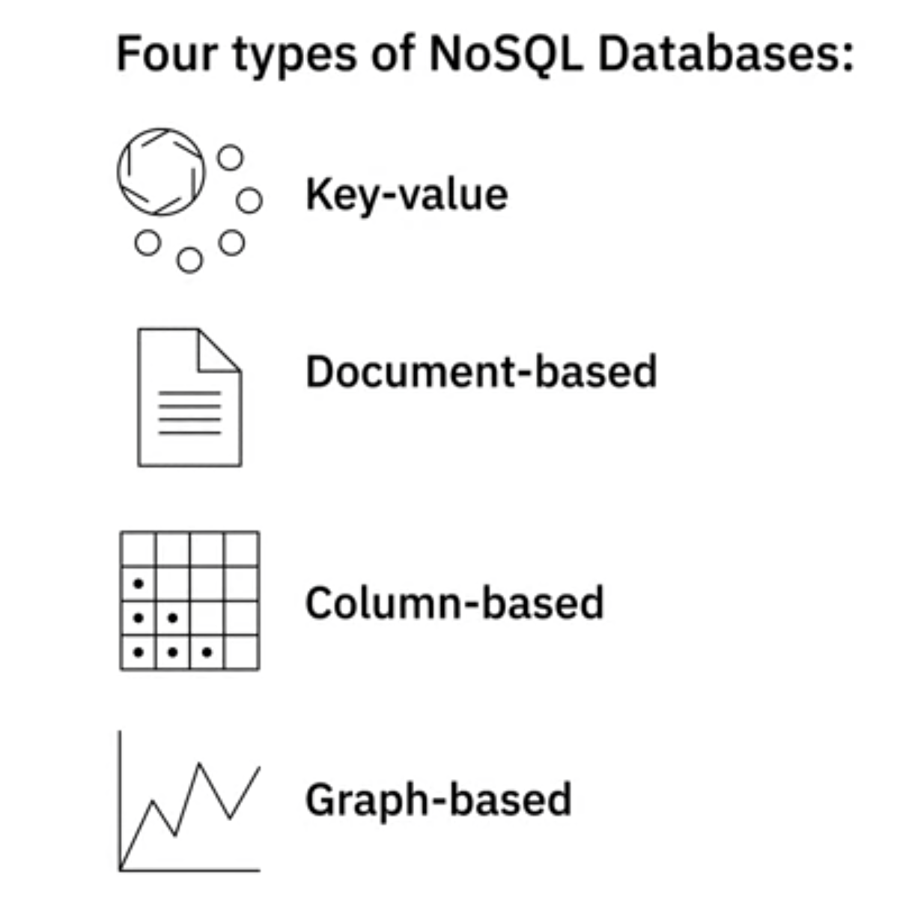
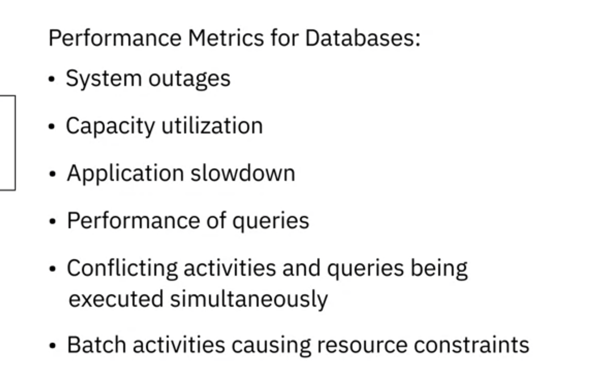
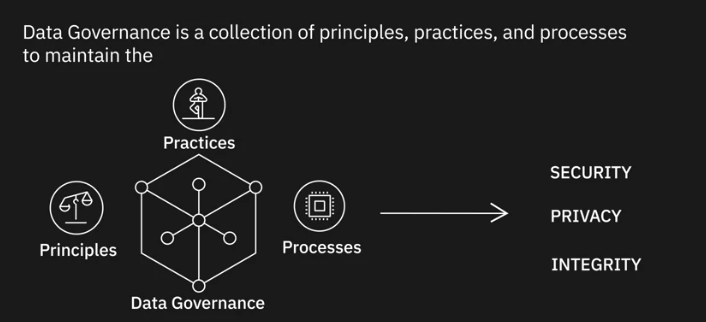
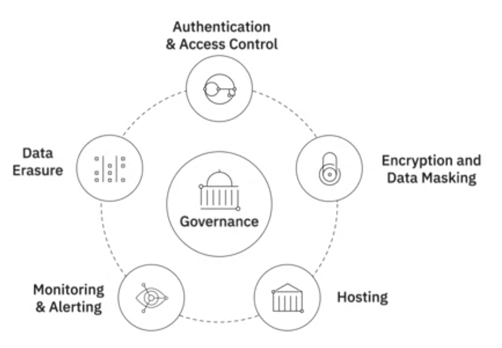
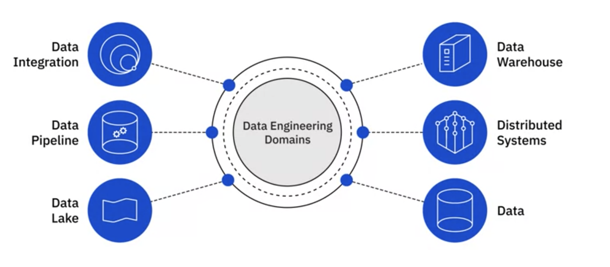
