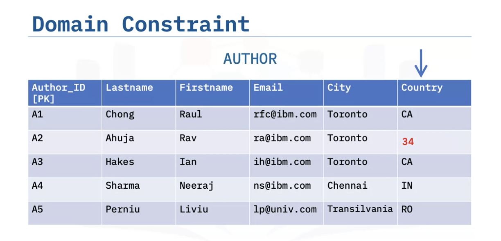

# Introduction to Relational Databases (RDBMS)

   * [Course Introduction](#course-introduction)
   * [Fundamental Relational Database Concepts: Summary & Highlights](#fundamental-relational-database-concepts-summary--highlights)
   * [Introducing Relational Database Products](#introducing-relational-database-products)
   * [Creating Tables and Loading Data](#creating-tables-and-loading-data)
   * [Designing Keys, Indexes, and Constraints](#designing-keys-indexes-and-constraints)
   * [MySQL](#mysql)
   * [PostgreSQL](#postgresql)
   * [Image Notes](#image-notes)

## Course Introduction

Welcome to Introduction to Relational Databases, the fourth in a series of courses on data engineering designed to prepare you for a career as a Junior Data Engineer. 

Every good relational database solution begins with a solid design and implementation strategy. A well-designed relational database ensures that the users and applications that depend on the data will know that it is:

- **Accurate**. Can you rely on the accuracy of the data as new information is added or it is modified? 
- **Easy to access**. Is the data organized in a way that makes it fast, easy, and predictable to query and maintain?
- **Reliable**. Can your database design ensure data integrity and maintain consistent and reliable data?
- **Flexible**. Can you update or expand on the design to meet future data requirements?

In this course, you will learn some basic relational database concepts and learn to think about data in terms of relationships and how information can be best organized to produce the results you want to achieve. You will also learn about different deployment topologies options and the tradeoffs that impact your design decisions. You will then move onto relational database design, creating an Entity Relationship Diagram for a specific use case that serves as the blueprint for the implementation of your database. You will also learn about the role of relational model constraints in ensuring that your data maintains its integrity and achieves a level of performance that meets the needs of the users of the data. 

With a solid plan, you will then learn how to use SQL statements and several Relational Database Management Systems (RDBMS) tools to transform a relational database design into a physical database and its objects, such as tables, keys, indexes, and constraints.

You will build hands-on experience by developing an Entity Relationship Diagram to map out the data model of a relational database, applying techniques that help improve the integrity of your data and the performance of your queries, and then implement the design in IBM Db2 on Cloud.

Watch the videos, work through the labs, and add to your portfolio. Good luck!

## Fundamental Relational Database Concepts: Summary & Highlights

Congratulations! You have completed this lesson. At this point in the course, you know: 

- The relational model is the most used data model for databases because this model allows for logical data independence, physical data independence, and physical storage independence. 
- Entities are objects that exist independently of any other entities in the database, while attributes are the data elements that characterize the entity.
- The building blocks of a relationship are entities, relationship sets, and crows foot notations. 
- Relationships can be one-to-one, one-to-many, or many-to-many.
- When translating an Entity-Relationship Diagram to a relational database table, the entity becomes the table and the attributes become columns in the table.
- Data types define the type of data that can be stored in a column and can include character strings, numeric values, dates/times, Boolean values and more.
- The advantages of using the correct data type for a column are data integrity, data sorting, range selection, data calculations, and the of standard functions.
- In a relational model, a relation is made up of two parts: A *relation schema* specifying the name of a relation and the attributes and a *relation instance*, which is a table made up of the attributes, or columns, and the tuples, or rows. 
- Degree refers to the number of attributes, or columns, in a relation. 
- Cardinality refers to the number of tuples, or rows in a relation.

## Introducing Relational Database Products

Congratulations! You have completed this lesson. At this point in the course, you know: 

There are four types of database topology:

- **Single tier.** The database is installed on a user’s local desktop. 
- **2-tier.** The database resides on a remote server and users access it from client systems. 
- **3-tier.** The database resides on a remote server and users access it through an application server or a middle tier. 
- **Cloud deployments.** The database resides in the cloud, and users access it through an application server layer or another interface that also resides in the cloud.

In shared disk distributed database architectures, multiple database servers process the workload in parallel, allowing the workload to be processed faster. There are three shared nothing distributed database architectures:

- **Replication.** Changes taking place on a database server are replicated to one or more database replicas. In a single location, database replication provides high availability. When database replica is stored in a separate location, it provides a copy of the data for disaster recovery.
- **Partitioning.** Very large tables are split across multiple logical partitions.
- **Sharding.** Each partition has its own compute resources.

There are different classes of database users, who use databases in different ways:

- Three main classes of users are Data Engineers, Data Scientists and Business Analysts, and Application Developers.
- Database users can access databases through Graphical and Web interfaces, command line tools and scripts, and APIs and ORMs.
- Major categories of database applications include Database Management tools, Data Science and BI tools, and purpose built or off the shelf business applications.
- Relational databases are available with commercial licenses or open source.
- MySQL is an object-relational database that supports many operating systems, a range of languages for client application development, relational and JSON data, multiple storage engines, and high availability and scalability options.
- PostgreSQL is an open source, object-relational database that supports a range of languages for client application development, relational, structured, and non-structured data, and replication and partitioning for high availability and scalability

## Creating Tables and Loading Data

- DDL statements, including CREATE, ALTER, TRUNCATE, and DROP, are used for defining objects like tables in a database.
- DML statements, including INSERT, SELECT, UPDATE, and DELETE, are used for manipulating data in tables.
- Many Relational Database Management Systems (RDBMS) have schemas that contain tables, views, functions, and other database objects.
- Most RDBMS provide a GUI through which you can create and alter the structure of tables. 

You can also create and alter tables by using DDL SQL statements:

- CREATE TABLE. Creates entities (tables) in a relational database and sets the attributes (columns) in a table, including the names of columns, the data types of columns, and constraints (for example, the Primary Key.)
- ALTER TABLE. Changes the structure of a table by adding or removing columns, modifying the data type of columns, and adding or removing keys and constraints.
- DROP TABLE. Deletes a table from a database.
- TRUNCATE TABLE. Removes all rows in a table.

There are utilities that help you to manage the movement of data:

- You use the BACKUP and RESTORE utilities to create and recover copies of entire databases, including all objects like tables, views, constraints, and data.
- You use the IMPORT utility to insert data into a specific table from different formats, such as DEL/CSV, ASC and IXF, and the EXPORT utility to save data from a specific table into various formats, such as CSV.
- You can use the LOAD utilities, instead of INSERT statements, to quickly insert large amounts of data a variety of different data sources into tables.
- The Load Data utility is a simple to use interface in the Db2 Web Console.

## Designing Keys, Indexes, and Constraints
Congratulations! You have completed this lesson. At this point in the course, you know: 

The objects in a Relational Database Management System (RDBMS) object hierarchy include:

- **Instances.** This is a logical boundary for a database or set of databases where you organize and isolate database objects and set configuration parameters. 
- **Relational databases.** This is a set of objects used to store, manage, and access data.
- **Schemas.** A user or system schema is a logical grouping of tables, views, nicknames, triggers, functions, packages, and other database objects. Schemas provide naming contexts so that you can distinguish between objects with the same name.
- **Database partitions.** You can split very large tables across multiple partitions to improve performance. 
- **Database objects.** Database objects are the items that exist within the database, such as tables, constraints, indexes, views, and aliases.

Primary key and Foreign Keys have several uses:

- Primary keys enforce uniqueness of rows in a table, whereas Foreign keys are columns in a table that contain the same information as the primary key in another table.
- You can use primary and foreign keys to create relationships between tables. Relationships between tables reduce redundant data and improve data integrity. 
- Indexes provide ordered pointers to rows in tables and can improve the performance of SELECT queries, but can decrease the performance of INSERT, UPDATE, and DELETE queries.

Normalization reduces redundancy and increases consistency of data. There are two forms of normalization:

- **First normal form (1NF).** In this form, the table contains only single values and has no repeating groups.
- **Second normal form (2NF).** This form splits data into multiple tables to reduce redundancy.

You can define six relational model constraints:

- **Entity integrity constraint.** Ensures that the primary key is a unique value that identifies each tuple (or row.)
- **Referential integrity constraint.** Defines relationships between tables.
- **Semantic integrity constraint.** Refers to the correctness of the meaning of the data.
- **Domain constraint.** Specifies the permissible values for a given attribute.
- **Null constraint.** Specifies that attribute values cannot be null.
- **Check constraint.** Limits the values that are accepted by an attribute.

## MySQL
Congratulations! You have completed this lesson. At this point in the course, you know: 

MySQL is a free, open-source RDMS that you can download and install on your own systems or access on the Cloud. You can either self-manage a Cloud instance of MySQL or use a managed services provider, including IBM Cloud, Amazon RDS for MySQL, Azure Database for MySQL, or Google Cloud SQL for MySQL.

MySQL includes several options for creating databases and tables, loading and querying data, and importing and exporting data relational databases:

- mysql and mysqladmin command line interfaces. You use these CLIs to run SQL statements.
- MySQL Workbench. A desktop application for designing, developing, and administering MySQL databases.
- phpMyAdmin. An easy to use, third-party web interface for working with MySQL databases.
- API calls.

Using phpMyAdmin, you can:

- Add and modify columns after you create a table.
- Use backup and restore functionality to populate databases.
- Use import and export functionality to populate tables and save their data to files.
- Create primary keys by defining a primary index on one or more columns.
- Use autoincrement to automatically generate sequential numeric data in a column.

When creating foreign keys, you can define ON DELETE and ON UPDATE actions.

MySQL columns are NOT NULL by default.

You can configure a column to only accept unique values.

## PostgreSQL

Congratulations! You have completed this lesson. At this point in the course, you know: 

PostgreSQL is an open-source object-relational database management system that you can download and install on your own systems or access on the Cloud.

You can either self-manage a Cloud instance of PostgreSQL or use a managed services provider, including IBM Cloud Databases for PostgreSQL, Amazon RDS, Google Cloud SQL for PostgreSQL, EnterpriseDB cloud, or Microsoft Azure for PostgreSQL.

PostgreSQL includes several options for creating databases and tables, loading and querying data, and importing and exporting data relational databases:

- The psql command line interface. You use this CLI to run SQL statements.
- pgAdmin. A graphical interface to the database server, which is available as a desktop application or as a web application that you can install on your web servers.
- Navicat and Dbeaver. Commercial graphical interface options that you can use to access PostgresSQL, MySQL, and other types of databases.
- Cloud vendor tools and APIs.

Using pgAdmin, you can:

- Use pg_dump to back up databases and psql to restore them.
- Use the Import/Export tool to load data into and export data from tables.

Using views:

- You can use views to limit access to sensitive data and simplify data retrieval.
- Views can be materialized, which means that the view store the result set for quicker subsequent access. 
- Materialized views enhance performance because the view is saved and often stored in memory. However, you cannot insert, update, or delete rows in a materialized view, and they must be refreshed before you can see updated data.

## Image Notes

## Course Team & Acknowledgements

This course has been brought to you through the involvement of the following team of contributors:

### **Primary Instructors**

Rav Ahuja Lin Joyner Rose Malcolm

### **Other Contributors and Staff**

Project Lead: Rav Ahuja	 Instructional Designers: Rose Malcolm, Lin Joyner Lab Authors: Sandip Saha Joy, Lin Joyner

### **Production Team**

Publishing: Eboney Hinds, Grace Barker QA: Pradnya Bhagwat Project Manager: Alison Woolford Narration: Bella West Video Production: Rajeev Kumar

### **Teaching Assistants and Forum Moderators**

Teaching Assistants: Malika Singla, Himanshu Birla, Lakshmi Holla
