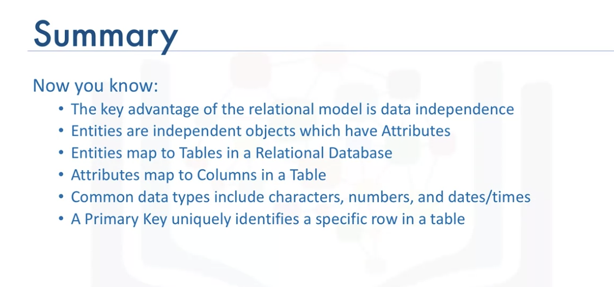

# Databases and SQL for Data Science with Python
-----

## Week 1

Congratulations! You have completed this lesson. At this point in the course, you know: 

- You can use Data Manipulation Language (DML) statements to read and modify data. 
- The search condition of the WHERE clause uses a predicate to refine the search. 
- COUNT, DISTINCT, and LIMIT are expressions that are used with SELECT statements. 
- INSERT, UPDATE, and DELETE are DML statements for populating and changing tables. 

## Week 2

Congratulations! You have completed this lesson. At this point in the course, you know: 

- A database is a repository of data that provides functionality for adding, modifying, and querying the data. 
- SQL is a language used to query or retrieve data from a relational database. 
- The Relational Model is the most used data model for databases because it allows for data independence. 
- The primary key of a relational table uniquely identifies each tuple or row, preventing duplication of data and providing a way of defining relationships between tables. 
- SQL statements fall into two different categories: Data Definition Language (DDL) statements and Data Manipulation Language (DML) statements.

## Week 3
### Refining your results

Congratulations! You have completed this lesson. At this point in the course, you know:

- You can use the WHERE clause to refine your query results.
- You can use the wildcard character (%) as a substitute for unknown characters in a pattern.
- You can use BETWEEN ... AND ... to specify a range of numbers.
- You can sort query results into ascending or descending order, using the ORDER BY clause to specify the column to sort on.
- You can group query results by using the GROUP BY clause. 

### Functions, Multiple Tables, and Sub-queries

Congratulations! You have completed this lesson. At this point in the course, you know:

- Most databases come with built-in functions that you can use in SQL statements to perform operations on data within the database itself.
- When you work with large datasets, you may save time by using built-in functions rather than first retrieving the data into your application and then executing functions on the retrieved data.
- You can use sub-queries to form more powerful queries than otherwise.
- You can use a sub-select expression to evaluate some built-in aggregate functions like the average function. 
- Derived tables or table expressions are sub-queries where the outer query uses the results of the sub-query as a data source.

## Image Notes

